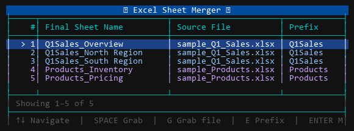

# Excel Sheet Merger

Merge sheets from multiple Excel files into a single workbook, preserving all
formatting, formulas, charts, tab colours, and styles.  
Runs entirely on your machine — no internet connection needed after setup.



---

## Requirements

- **Windows** (uses Excel's COM API via `pywin32`)
- **Microsoft Excel** installed
- **Python 3.8+** (including Microsoft Store installs)
- Two Python packages: `pywin32` and `windows-curses`

---

## Setup

### 1. Install dependencies

Run the setup script once from PowerShell:

```powershell
.\setup.ps1
```

The script checks what is already installed and skips anything it finds.  
If a package wheel is missing it tells you exactly which file to download and where to save it.

**If `pywin32` is not yet installed:**

1. Open the URL shown by the script in Chrome
2. Download the `.whl` file matching your Python version and architecture (e.g. `pywin32-308-cp312-cp312-win_amd64.whl`)
3. Save it to the `wheels\` folder next to `setup.ps1`
4. Re-run `.\setup.ps1`

**If `windows-curses` is not yet installed:**

1. Open the URL shown by the script in Chrome
2. Download the `.whl` file (e.g. `windows_curses-2.3.3-cp312-cp312-win_amd64.whl`)
3. Save it to the `wheels\` folder
4. Re-run `.\setup.ps1`

### 2. (Optional) Generate sample files for testing

```powershell
python create_samples.py
```

Creates `sample_Q1_Sales.xlsx` (3 sheets) and `sample_Products.xlsx` (2 sheets)
in the script directory.

---

## Usage

```powershell
# Scan the script's own directory
python merger.py

# Scan a specific directory
python merger.py "C:\path\to\your\excel\files"
```

Excel files (`.xlsx`, `.xls`, `.xlsm`, `.xlsb`) are discovered automatically.

---

## TUI controls

The full-screen interface lists every sheet found, grouped by file.

| Key | Action |
|-----|--------|
| `↑` / `↓` | Move cursor |
| `Home` / `End` | Jump to first / last sheet |
| `Space` | Grab the current sheet; move it with `↑`/`↓`; press `Space` again to drop |
| `G` | Grab all sheets from the current file as a group; move with `↑`/`↓`; `Space` to drop |
| `DEL` or `R` | Remove all sheets from the current file from the output |
| `E` | Edit the prefix used for all sheets from the current file |
| `Enter` | Confirm the order and proceed to merge |
| `Q` or `Esc` | Quit without merging |

**Sheet naming:** every output sheet is named `{prefix}_{original sheet name}`.  
The prefix defaults to the filename (without extension) and can be changed with `E`.  
Names are automatically truncated to Excel's 31-character limit, and duplicates get a `_2`, `_3`, … suffix.

---

## Output

After confirming, you are prompted for an output filename (default: `merged_output.xlsx`
in the scanned directory). If the file already exists you are asked before overwriting.

The tool then:
1. Copies each sheet in the chosen order via Excel's COM API (full fidelity — no parsing)
2. Verifies the output by reopening it and listing all sheet names
3. Prints the final path

---

## Troubleshooting

| Symptom | Fix |
|---------|-----|
| `pywin32 not found` | Run `.\setup.ps1` |
| `Could not start Excel COM server` | Make sure Microsoft Excel is installed; try running `python Scripts\pywin32_postinstall.py -install` |
| `Cannot write 'merged_output.xlsx'` | Close the file in Excel first |
| Terminal too small | Resize the window to at least 44 columns × 13 rows |
| Microsoft Store Python opens the Store instead of running | Use the full path: `.\setup.ps1 -PythonExe "C:\Users\<you>\AppData\Local\Microsoft\WindowsApps\python3.exe"` |
